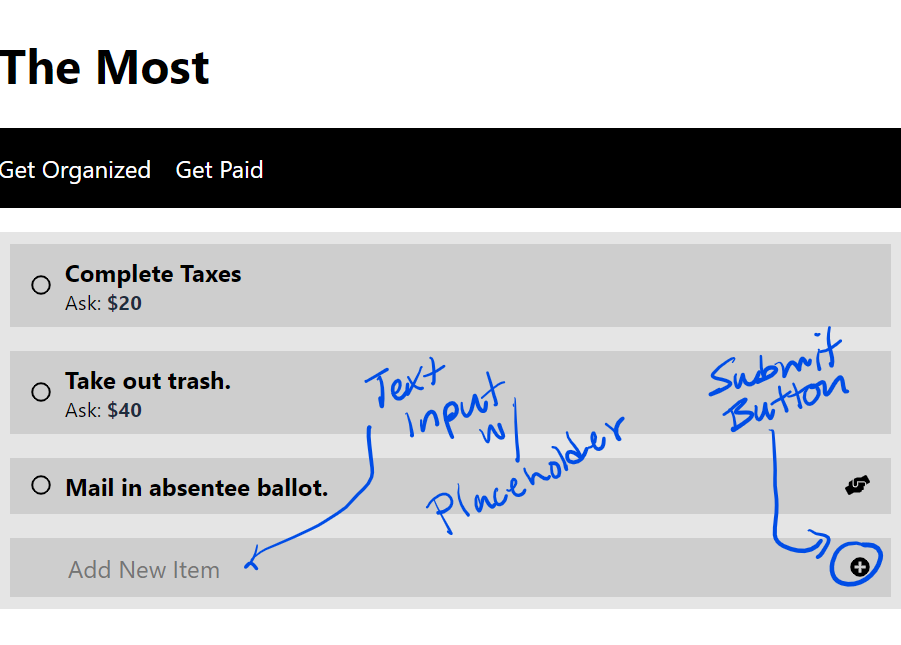
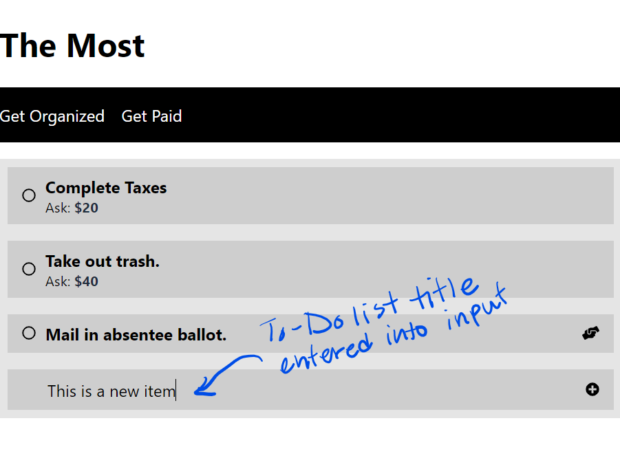
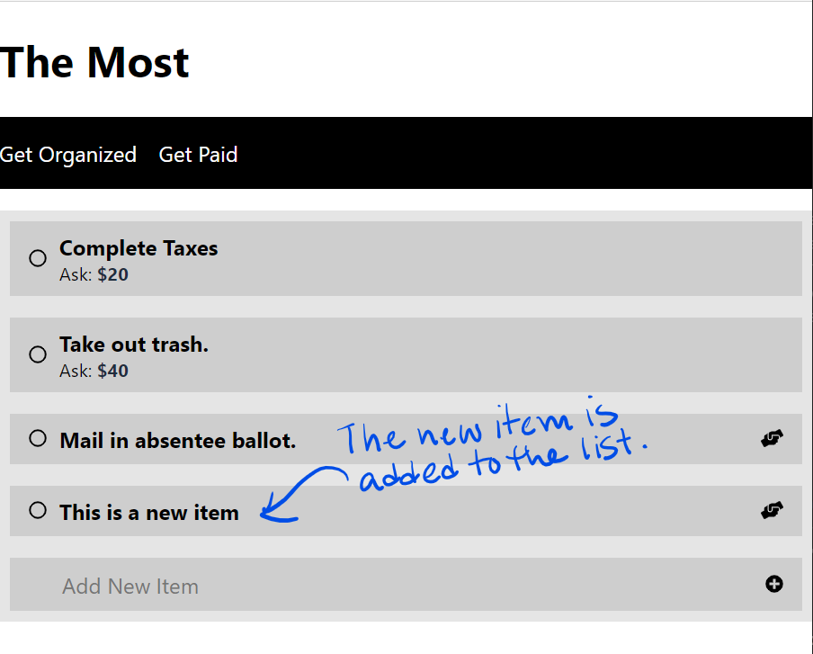
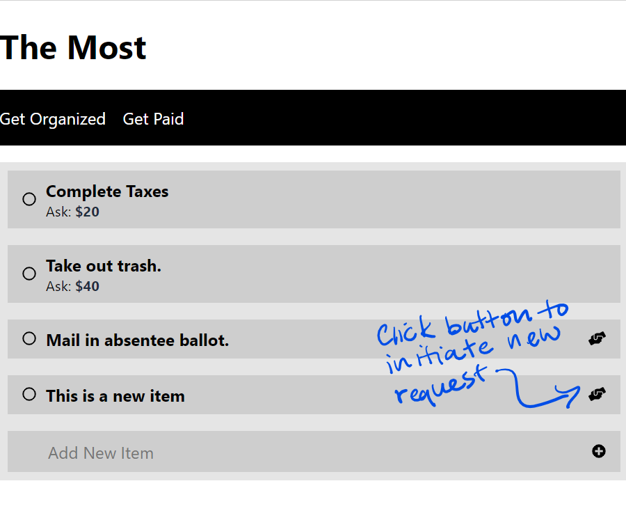
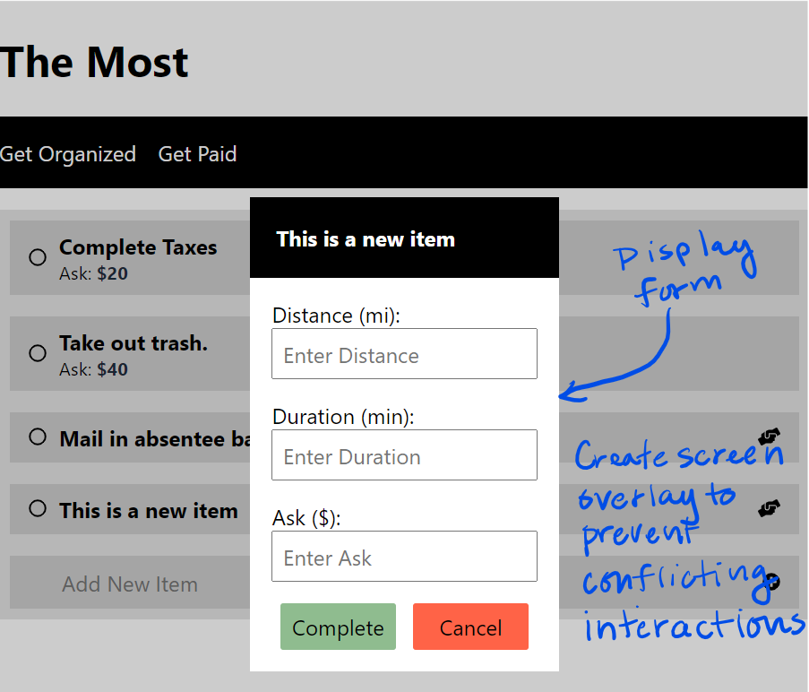
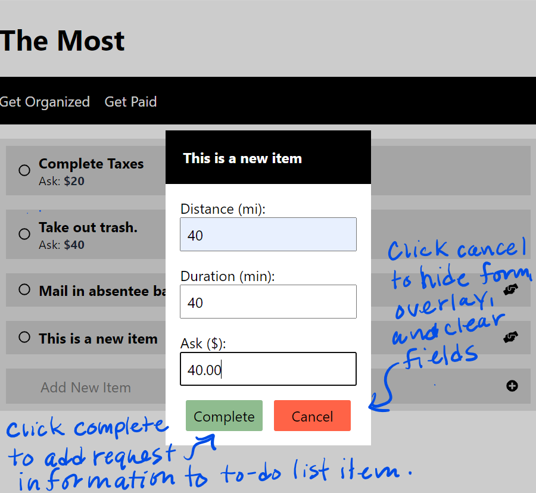
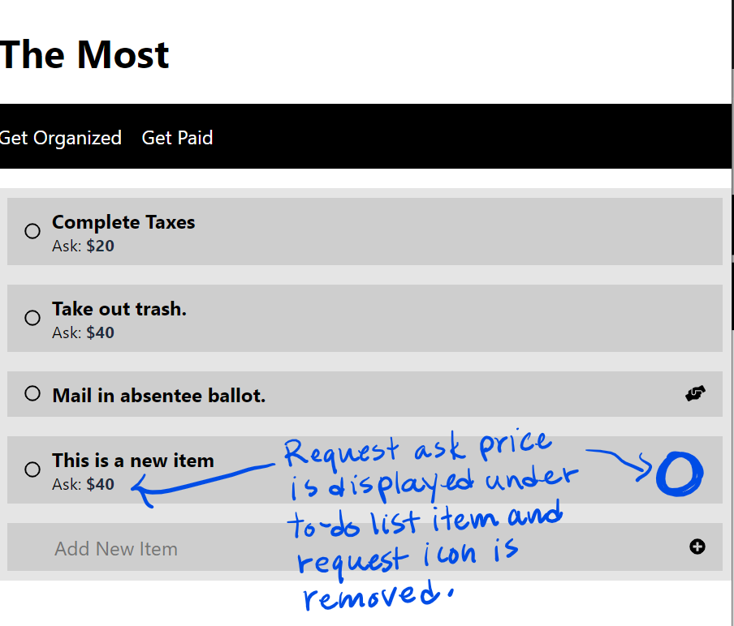
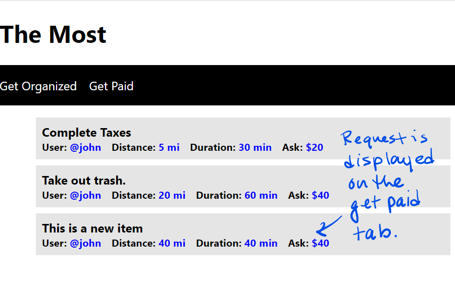

# Getting Started Guide

### Install Git
Install the latest version of [Git](https://git-scm.com/) from https://git-scm.com/downloads.
> **Note:** The installation includes the Git command line interface, which enables the execution of source control tasks such as cloning repositories, creating branches, and committing changes.

### Install Node.js
Install the latest version of [Node.js](https://nodejs.org/) from https://nodejs.org/en/download/. 
> **Note:** The installation includes the Node.js runtime (node.exe) and the Node Package Manager (npm.exe). 

### Install Yarn (Optional)
Install the latest version of [Yarn](https://classic.yarnpkg.com/) from https://classic.yarnpkg.com/en/docs/install/#windows-stable.
>**Note:** While Node Package Manager (NPM) is the default dependency management tool for Node.js, there are popular alternatives such as Yarn that provide a much simpler experience.

### Install TypeScript
Install the latest version of TypeScript by executing one of the following the commands: 

Install TypeScript via NPM
```bash
npm i typescript -g
```
or

Install TypeScript via Yarn
```bash
yarn global add typescript
```

### Install Visual Studio Code (Recommended)
Install the latest version of [Visual Studio Code](https://code.visualstudio.com/) from https://code.visualstudio.com/download
>**Note:** Visual Studio Code is popular code editor that offers rich support for a variety of languages (e.g. Java, C#, JavaScript, TypeScript, Python, etc.) via its plug-in system.  

## Getting Started with Source Control
### Create a GitHub Account
1. Sign up for a GitHub account at https://github.com.

### Fork the Repository
1. Go to the repository https://github.com/bvcc-swe/bvcc
1. Click the **Fork** button.
1. When prompted to select a fork location, select your personal GitHub account.

### Clone the Repository
1. From the Code tab on the forked repository page, select the **Code** button.
1. From the pop-up menu, select the HTTPS tab in the Clone section.
1. Copy the repository URL.
1. Run `git clone <RepositoryUrl> <LocalDirectory>` from the command line.
> **Example:** git clone https://github.com/bvcc-swe/bvcc.git C:\users\jack\source\repos

## Getting Started With Development
For this exercise, two versions of the To-Do list React application were created. One version was written using React and JavaScript (bvcc-to-do-js), while the other was written using React and TypeScript (bvcc-to-do-ts). For those who are new to web development, we recommend that you attempt the assignment using the project that uses React and JavaScript. For those with more web development experience, we recommend that you attempt the assignment using the project that uses React and TypeScript.

### Open Project in Visual Studio Code
1. Open the folder `<RepositoryRoot>\sessions\7\bvcc-to-do-xx` in Visual Studio Code.
>**Note:** The root repository is the same as the location where the repository was initially cloned.

### Install Dependencies
Many applications depend on code libraries from third-party sources to provide functionality and reduce the amount of custom code that must be written and maintained. Third-party code libraries are commonly referred to as dependencies. Dependencies are typically not stored in source control because of the frequency of version changes and the amount of storage required to maintain them. As such, they must be installed before you begin development. To install the project dependencies follow the instructions below.
1. Open the terminal in Visual Studio Code (Menu &#8594; View &#8594; Terminal) 
1. Execute one of the following commands:

Install dependencies via NPM.
```bash
npm install
```
or

Install dependencies via Yarn.
```bash
yarn install
```

### Start the React App
Changes to your application must be viewed in a web browser. This process has been made convenient by automation that is included with applications generated by the [create-react-app](https://github.com/facebook/create-react-app) CLI. The automation opens a web browser that points to the locally hosted application, and refreshes the application whenever changes are detected. This feature is ideal for web developers who want to see the immediate impact of their code changes. To use this automation follow the steps below.
1. Execute one of the following commands from the Visual Studio Code terminal:

Start React application via NPM.
```bash
npm start
```
or

Start React application via Yarn.
```bash
yarn start
```

## Assignment
For this assignment you must complete at least one of the features below.
### Feature: Enable Users to Create a To-Do List Item
For this feature you will add a mechanism that allows users to create a to-do list item by entering text into an input field and clicking a button to complete the operation. The feature should be developed according to the mockups below:




### Feature: Enable Users to Create a Request for an Existing To-Do List Item
For this feature you will create a mechanism that allows users to create a help request for an existing to-do list item. To initiate this request, users will complete a form that is accessed via the "request help" button. Once the form has been completed the request information will be added to the to-do list item, and represented on the Get Organized and Get Paid tabs. The feature should lbe developed according to the mockups below:






# Resources
- [React](https://reactjs.org/tutorial/tutorial.html)
- [Mozilla Javascript Documentation](https://developer.mozilla.org/en-US/docs/Web/JavaScript)
- [Typescript](https://www.typescriptlang.org/)
- [React&FontAwesome](https://fontawesome.com/how-to-use/on-the-web/using-with/react)