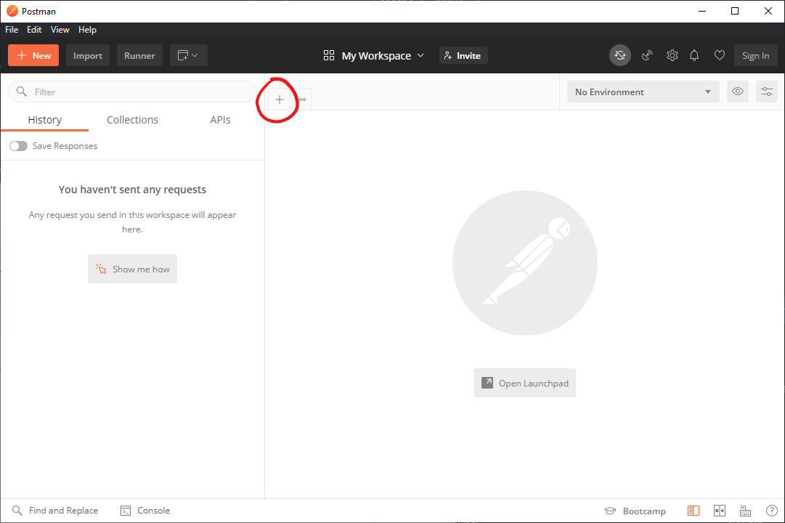
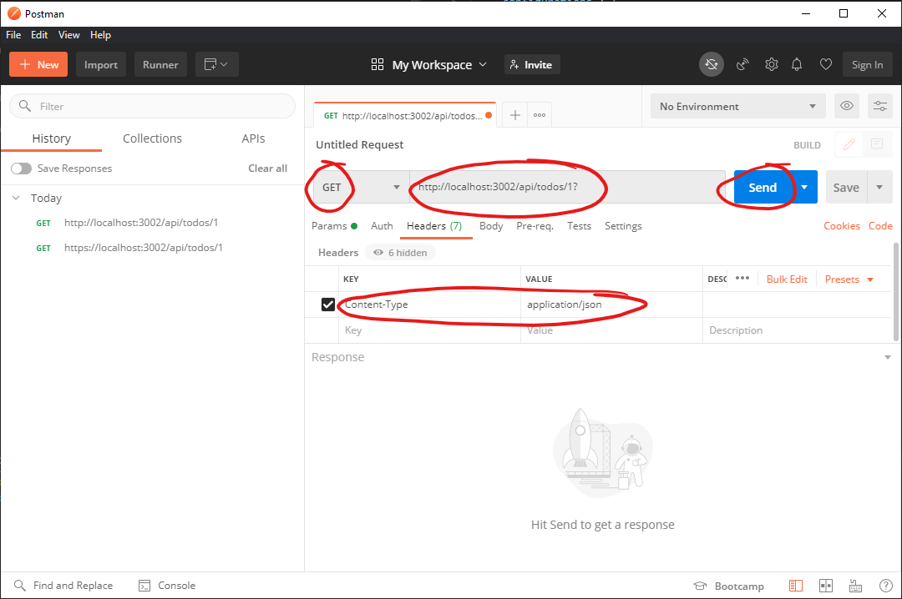
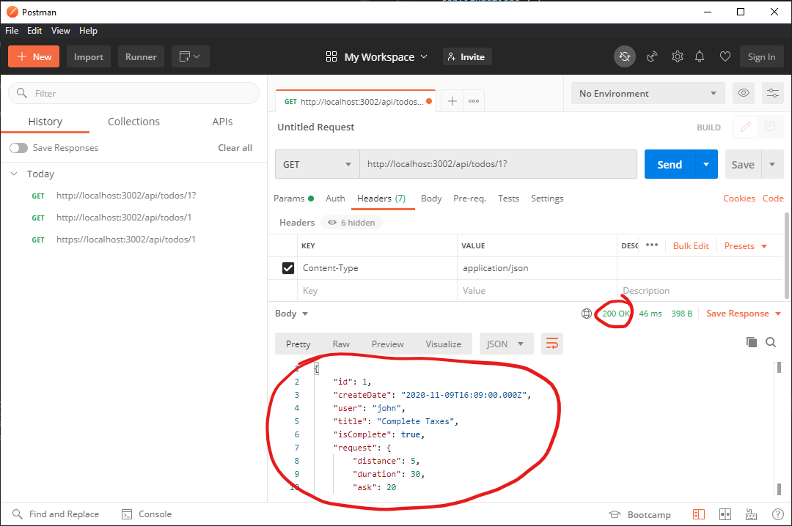

# Getting Started
## Prerequisites
- Install [NodeJS](https://nodejs.org/en/download/)
- Run `$ npm install` in the terminal to install all dependencies
- [ExpressJS] (https://expressjs.com/en/4x/api.html), Body Parser, Cors
- Install [Visual Studio Code](https://code.visualstudio.com/download)
- Install [Postman](https://www.postman.com/downloads/)

## Assignment
This assignment focuses on creating and using a Web API. Your task is to complete a Web API that will be used by the Web Client, from the previous assignment, to perform create, read, update, and delete operations on to-do list items. The API will support two URLs, `/api/todos` and `/api/todos/{id}`. Each URL will support one or more HTTP methods including GET, POST, PUT, and DELETE. The table below summarizes the HTTP methods that will be supported for each URL.
| URL | HTTP Method | Description |
|-----|--------|-------------|
|/api/todos| GET | Gets all to-do list items.|
|/api/todos| POST | Creates a to-do list item. |
|/api/todos/{id}| GET | Gets the to-do list item with the specified ID.|
|/api/todos/{id} | PUT | Updates the to-do list item with the specified ID.|
|/api/todos/{id} | DELETE | Delete the to-do list item with the specified ID.|
>##### Table 1. The list of URL/HTTP method combinations that will be supported by the Web API.
\
To build a Web API that supports the URLs and HTTP methods described in the table above we will use [Express](https://expressjs.com). Express is a minimalist web framework that runs on [Node.js](https://nodejs.org). Express represents combinations of URLs and HTTP methods as [routes](https://expressjs.com/en/guide/routing.html). Each routes is activated when the Web API receives an HTTP request that matches a URL/HTTP method combination.

To help you get started, a template project has already been created in `/sessions/8/assignment/bvcc-to-do-api`. The template project includes route support for getting all to-do list items (URL: /api/todos, Method: GET), and updating a to-do list item (URL: /api/todos, Method: PUT). The implemented routes and the Express documentation on [routing](https://expressjs.com/en/guide/routing.html) should provide hints that will assist you with creating the remaining routes.

To add the support for the remaining routes, edit the code in the file, `/sessions/8/assignment/bvcc-to-do-api/src/routes/todo.js`. The following section, Route Details, provides more details on how to implement the remaining routes. For convenience, these details are repeated as comments in the todo.js file.
### Route Details
#### Get a To-Do List Item with the Specified ID
- Create a route that supports the **GET** method for the URL, **/api/todos/{id}**.
- If an item with the specified ID exists within the items collection, send the item to the client as JSON.
- If the item does not exist in the collection, send the client an [HTTP Status Code](https://developer.mozilla.org/en-US/docs/Web/HTTP/Status) of 404.

#### Create a To-Do List Item:
- Create a route that supports **POST** method for the URL, **/api/todos**.
- The new item should be read from the body of the request and converted to a JSON object. The new item will automatically be converted to JSON if the request specifies the Content-Type header as `application/json`, and the request body content is a valid [string representation of a JSON object](https://developer.mozilla.org/en-US/docs/Web/JavaScript/Reference/Global_Objects/JSON/stringify).
- The new item should be assigned an id whose value is 1 greater the largest id for an item in the existing collection.
- Return the item containing the new id to client.

#### Delete the To-Do List Item with the Specified ID:
- Create a route that supports **DELETE** method for the URL, **/api/todos/{id}**.
- If an item with the specified ID exists within the collection, remove it.
- Return a HTTP status code, 200.

## How To: Test the Web API
To test the Web API you will run it locally, and use Postman to initiate various type of HTTP requests.

### Running the API
1. Open Visual Studio Code.
1. Open the folder (File &#8594; Open Folder), `bvcc/sessions/8/assignment/bvcc-to-do-api`.
1. Open a terminal (View &#8594; Terminal), and run `npm install` from the project root directory to install the project dependencies.
1. From the main menu, select Run &#8594; Start Debugging.  
**Note:** This command will host the API at http://localhost:3002.

### Sending HTTP Requests with Postman
1. Open the Postman application.  
**Note:** Postman will prompt you to create an account the first time you open the application. You can skip this step by selecting the option to [Skip signing in and take me straight to the app](https://community.postman.com/t/how-to-skip-account-creation/11469) located at the bottom of the screen.
1. In the right pane, click the **+** tab.  

1. Select the HTTP method. (e.g. GET, PUT, POST, DELETE).
1. Input the URL (e.g. "http://localhost:3002/api/todo/1")
1. Add the HTTP header key, **Content-Type**, and the value, **application/json**.
1. Click the Send button.  

1. Verify that the response HTTP status code is 200, and that the appropriate JSON data is returned in the response body.  
**Note:** The response body will contain data depending on the type of request that was issued. For example, a DELETE request will not return any data in response body, while a GET request will.  

### Supported Requests
The table below lists sample requests that are supported by the Web API. Verify that the Web API works by executing these requests using Postman. 
|Description|URI|Method|Headers|Body|
|-----------|----|-------|------|----|
| Get the collection of to-do list items.|http://localhost:3002/api/todos | GET | Content-Type: application/json | N/A |
| Get the collection of to-do list items where the user is `jane`.|http://localhost:3002/api/todos?user=jane | GET | Content-Type: application/json | N/A |
| Get the collection of to-do list items where the user is `jane` and isComplete is `true`. |http://localhost:3002/api/todos?user=jane&isComplete=false | GET | Content-Type: application/json | N/A |
| Get the to-do list item where the ID is `2`.|http://localhost:3002/api/todos/2 | GET | Content-Type: application/json | N/A |
| Create a new to-do list item. |http://localhost:3002/api/todos | POST | Content-Type: application/json | "{"title":"Complete mail-in ballot."}" |
| Change the title of the to-do list item where the ID is `2`.|http://localhost:3002/api/todos/2 | PUT | Content-Type: application/json | "{"title":"Confirm mail-in ballot was received."}" |
| Delete the to-do list item where the ID is `2`.|http://localhost:3002/api/todos/2 | DELETE | Content-Type: application/json | N/A |

## How To: Test the Web API with the Web Client
**Note:** The client and the API must run simultaneously 

To complete this, open two VS Code windows.

In one window run the client by going to the sessions/8/bvcc-to-do-js 
1. `cd src` 
1. run ` $ npm install` to install all dependencies
1. run `$ npm start` to start the client

In the other window go to sessions/8/assignment/bvcc-to-do-api
1. run `$ npm install` to install all dependencies
1. run `$ node index.js` and it should say "Hello world app listening on port 3002!" when it is successful

After the Web Client and Web API are running, go to the console where the React app is running
1. Add a todo with any title 
1. Then refresh the page, you should see that todo does not delete
1. Delete one of the existing todos and refresh the page, you should get the same result

Now do a Ctrl^C in the terminal that's running the api (index.js) and run it again. Go back to the console and refresh the page. You should see that todo from what we originally started are there and not the ones we created. 