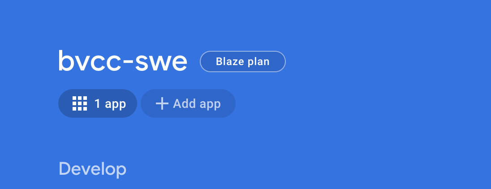
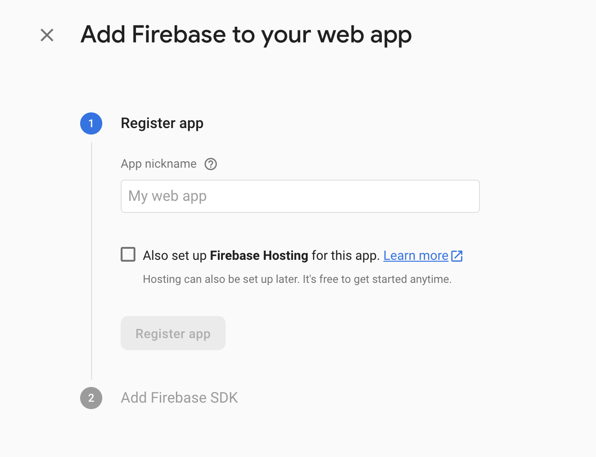
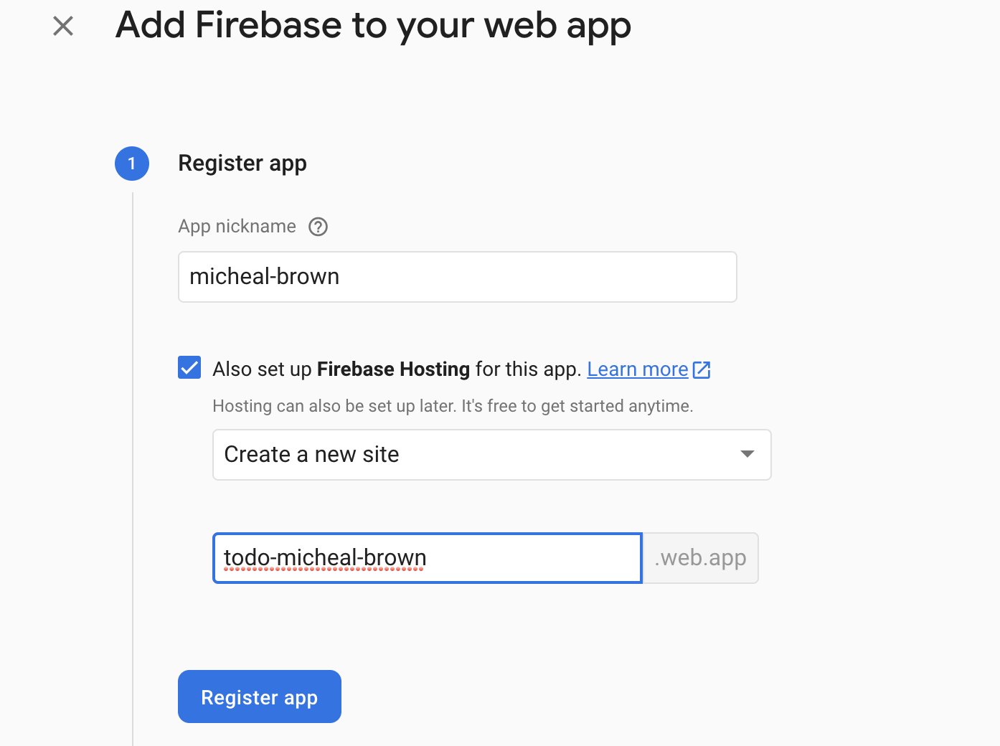
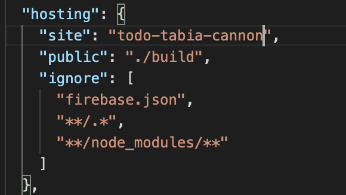

## How to Create a Build folder for your Client (React app)
- In order to host our client onto the internet we must first create a production build. Luckily React already has this functionality built in so we just have to do a simple command. 
 
- Go to the directory where you have the session 9 folder go to the bvcc-todo-js folder then run the command `npm run build` 
 
- Once that is complete your react app should be ready for hosting.

 
## How to deploy your react client onto firebase
The client needs to be hosted through firebase so that it can be accessed through any web browser and can interact with the API that we created.

 
## Create an app on the firebase 
Each firebase project uses an “app” within the project to utilize the services
Click the plus sign on the homescreen that says “add app +”

 
Once you select that it will ask you what type of app you want and we are building a web application. 
 

 

## Add firebase to your app

Once you select a web application the “Add firebase App” screen should pop up.

 
1. The first step is picking a name to register your app under. Your name should be {firstname-lastname} all lowercase. For example mine would be tabia-cannon 
	
    1. Click the checkbox that says “Also set up Firebase Hosting for this app” 
    1. Select “create a new site” and name it todo-{firstname}-{lastname}.web.app 
    Example: “todo-tabia-cannon.web.app” would be mine
    Then click register app

    

1. The firebase SDK has already been added so just click next
1. Install Firebase CLI
    - Run the command `npm install -g firebase-tools` in the same directory as bvcc-todo-js
1. Deploying Firebase Hosting - follow the steps given except for when you change the hosting section in the firebase.json follow their steps and change public to “./build” or whatever the path is to access the build folder we created for our client

	
 

## Verify that your app is hosted to the internet
Go to the url that you created it should be todo-{firstname}-{lastname}.web.app and see if your todo site pops up
- Interact with the api by creating two todos and refresh the page and go to the firebase console under the firebase store tab.
*insert picture*
- You should go to the collection name that has your name on it and verify that those todos have been added to the database
*insert picture*
- Go and deleted one of those todos and verify that is has been deleted from the database
 
 
 
 
 
 
 
