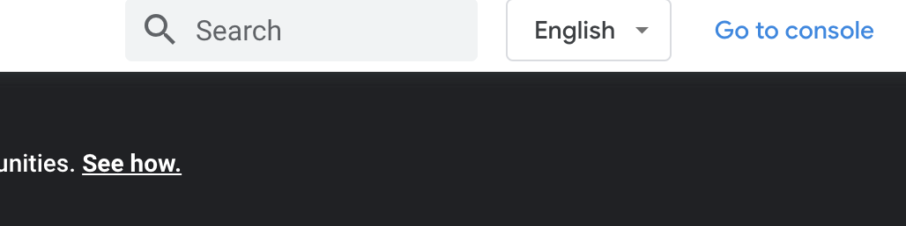
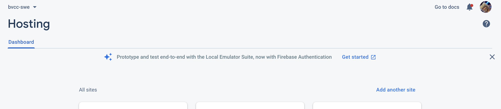
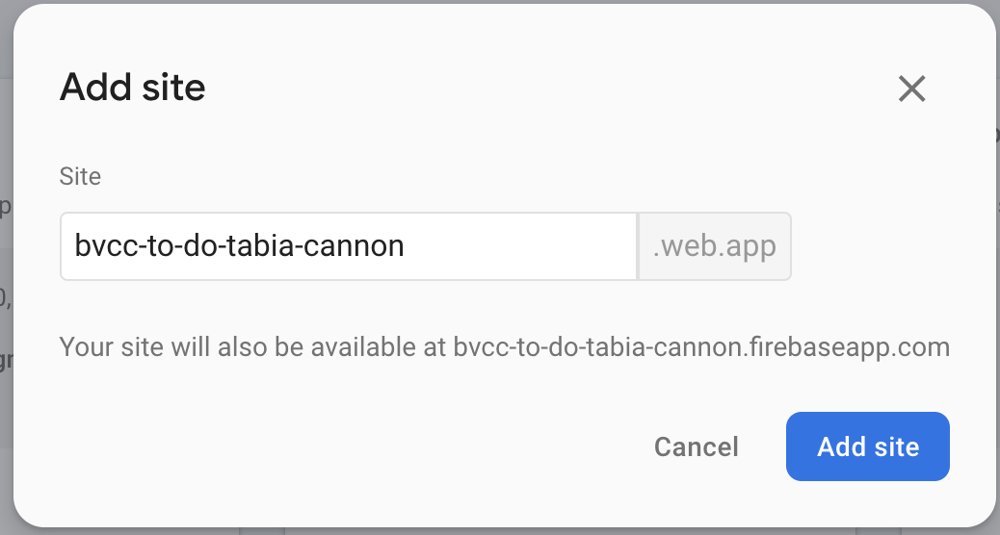

## Prerequisites
1. Install [NodeJS](https://nodejs.org/en/download/)
1. Install [Java SE](https://www.oracle.com/java/technologies/javase-downloads.html)
1. Create a [Firebase](https://firebase.google.com) account.

#
## How to deploy the React client with Firebase
The client needs to be hosted through firebase so that be connected to the internet and accessed/interact the API through any web browser.

1. Go to [Firebase](https://firebase.google.com) and press 'Go to Console' in the top right 
1. Login and go to the bvcc-swe project
1. Navigate to the hosting section on the left side
1. You should see this at top of the page 
1. Press 'Add another site'
1. Name your site in the format `bvcc-to-do-{firstname}{lastname}.web.app` 

Verify that you see your new hosting site in the list 

#
## Set up Hosting Environment
 1. Install Firebase Tools 
 ```
  $ npm install -g firebase-tools
  ```
2. Initialize Firebase Hosting
```
 $ firebase init hosting
```
#
## Project Set up
1. Select `Use an existing project` with Enter
1. Select `bvcc-swe (bvcc-swe)` with Enter
1. What do you want to use as your public directory? `build` 
1. Create a single-page app (rewrite all urls to /index.html)? `Y`
1. Set up automatic builds and deploys with Github? `N`

Firebase Initialization complete!

## Update the URL in the environment
1. Go to the `.env` file 
1. Update the React App Api Host with the API you created in the bvcc/sessions/9/assignment/bvcc-to-do-api folder
```
REACT_APP_API_HOST=https://us-central1-bvcc-swe.cloudfunctions.net/{firstname}{lastname}
```
#
## Build the Client (React App)
In order to host our client onto the internet we must first create a production build. 

1. Go to `bvcc/sessions/9/assignment/bvcc-to-do-client` 
1. Run the build command 
```
$ npm run build
``` 
Once that is complete the client is ready for hosting!

#
## Deploy your App
1. Run the firebase deploy only hosting commmand
```
$ firebase deploy --only hosting
```

#
## Verify that your app is hosted to the internet
Go to the url that you created it should be `bvcc-to-do-{firstname}-{lastname}.web.app` and see if your todo site pops up
1. Interact with the api by creating 2 todos. 
1. Refresh the page and verify that the todos are still there
1. Go to the cloud firebase store tab on firebase.

Go to the collection that has your name on it and verify that the 2 todos that we created have been added to the database.

1. Delete one of those todos we created on the browser 
1. Verify that is has been deleted from the database
 
 
 
 
 
 
 
