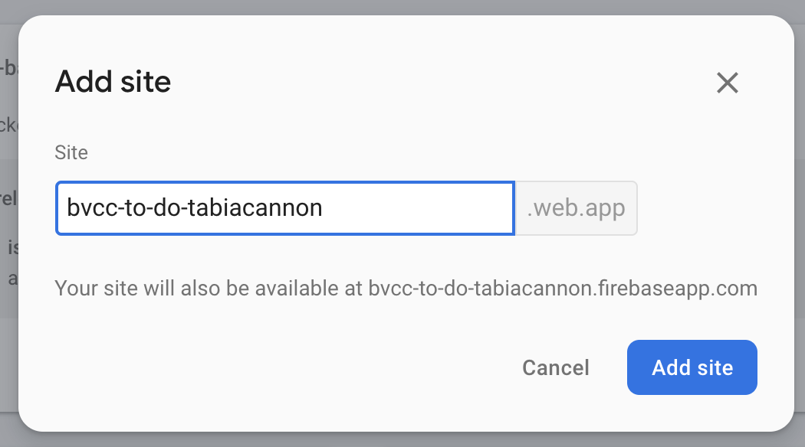

# Part 2: Getting Started With Deployment
Firebase - 9.3.0 version

In order to make the client application available on the internet, it must be deployed to a hosting service. A hosting service stores your application files, and makes them accessible on the internet via a  URL. To host your client application, you will deploy it through Firebase's Hosting service. The steps below will guide you through building and deploying your client.

## Create a Firebase Site
Before you deploy your application to Firebase, you must create a site using the Firebase Hosting service. The site defines a storage location, and your application's URL. The steps below will guide you through creating a site.

1. Go to https://firebase.google.com and press 'Go to Console' in the top right 
1. Login and go to the `bvcc-swe project`.
1. Navigate to the hosting section on the left side.
1. You should see this at top of the page 
1. Press 'Add another site'.
1. Name your site in the format `bvcc-to-do-{firstname}{lastname}.web.app` .
1. Verify that you see your new hosting site in the list.


#
## Update the Application Configuration
1. Open the file, [.\sessions\9\assignment\bvcc-to-do-client\\.env](.env). 
1. Replace the value of the `REACT_APP_API_HOST` with the URL of the API you deployed in [Part 1](../bvcc-to-do-api/README.md) of this assignment.
    ```
    REACT_APP_API_HOST=https://us-central1-bvcc-swe.cloudfunctions.net/{firstname}{lastname}
 
## Configure Firebase Project
1. Open a command prompt session.
1. Change the working directory to `./sessions/9/assignment/bvcc-to-do-client`. 
1. Install the Firebase CLI. 
    ```
    $ npm install -g firebase-tools
    ```
2. Initialize Firebase Hosting project.
    ```
    $ firebase init hosting
    ```
    1. Select `Use an existing project` (with spacebar) and then hit enter to submit
    1. Select `bvcc-swe (bvcc-swe)` 
    1. What do you want to use as your public directory? `build` 
    1. Create a single-page app (rewrite all urls to /index.html)? `Y`
    1. Set up automatic builds and deploys with Github? `N`
3. Specify the site name by adding a site property to the hosting object in the `./sessions/9/assignment/bvcc-to-do-client/firebase.json`
    
    1. Add your custom hosting site to the hosting section
    `"site": "bvcc-to-do-{firstname}{lastname}`

    ```
    {
        "hosting": {
            ...
            "site": "bvcc-to-do-tabiacannon"
            ...
        }
    }

    ``` 
    


## Build the Client (React App)
In order to deploy your client to Firebase, we must create a production build. 

1. Open a terminal and change the working directory to `bvcc/sessions/9/assignment/bvcc-to-do-client`
1. Install Dependencies 
    ```
    $ npm install
    ```
1. Build the client application.
    ```
    $ npm run build
    ``` 

## Deploy the Client

1. Deploy the client to Firebase.
    ```
    $ firebase deploy --only hosting
    ```

## Validate Deployment
1. Go to `https://bvcc-to-do-{firstname}-{lastname}.web.app`.
1. Use the client to create two to-do list items. 
1. Refresh the page, and verify that the to-do list items are displayed.
1. Go to the [Cloud Firestore](https://console.firebase.google.com/project/bvcc-swe/firestore) tab on Firebase.
1. Go to the collection that has your name, and verify that the two to-do list items that you created have been added to the database.
1. Delete one of the to-do list items that you created using the client. 
1. Return to the client application, and verify that the item is no longer displayed.
 
 
 
 
 
 
 
